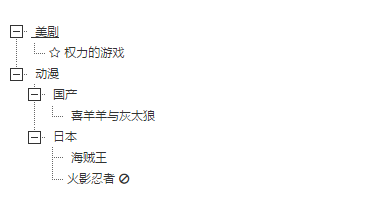

# vue-mini-ztree

> mini ztree for vue.js 2.0

## 预览图

## 用法
组件代码在 `src/components/ztree` 中， `src/page/demo`为demo代码

### demo 代码如下
	<template>
	  <ztree :treeData="ztreeData" :flatten="true" @nodeClick="nodeClick"></ztree>
	</template>
	
	

## 参数说明

<table border="1">
	<tbody>
		<tr>
			<td>参数</td>
			<td>类型</td>
			<td>默认值</td>
			<td>描述</td>
		</tr>
		<tr>
			<td>treeData</td>
			<td>Array</td>
			<td>[]</td>
			<td>ztree树数据源，支持常规树结构和打平的树结构</td>
		</tr>
		<tr>
			<td>allOpen</td>
			<td>Boolean</td>
			<td>false</td>
			<td>是否全部展开</td>
		</tr>
		<tr>
			<td>flatten</td>
			<td>Boolean</td>
			<td>false</td>
			<td>数据源是否为打平的树，如果是打平的树结构请务必设置为true, false为常规树结构，true为打平树结构</td>
		</tr>
		<tr>
			<td>事件nodeClick</td>
			<td>Function</td>
			<td>--</td>
			<td>监听节点点击事件，传递的参数为节点callbackInfo</td>
		</tr>
	</tbody>
</table>

## 树 数据源说明
一个node节点可以包含以下字段

<table border="1">
	<tbody>
		<tr>
			<td>参数</td>
			<td>类型</td>
			<td>必须</td>
			<td>描述</td>
		</tr>
		<tr>
			<td>name</td>
			<td>String</td>
			<td>是</td>
			<td>节点名称</td>
		</tr>
		<tr>
			<td>children</td>
			<td>Array</td>
			<td>否</td>
			<td>保存该节点孩子节点（适用于常规树结构）</td>
		</tr>
		<tr>
			<td>icon</td>
			<td>String</td>
			<td>否</td>
			<td>节点前面的图标</td>
		</tr>
		<tr>
			<td>lastIcon</td>
			<td>String</td>
			<td>否</td>
			<td>节点后面的图标</td>
		</tr>
		<tr>
			<td>callbackInfo</td>
			<td>类型不限</td>
			<td>否</td>
			<td>点击节点后回传的信息</td>
		</tr>
		<tr>
			<td>disable</td>
			<td>Boolean</td>
			<td>否</td>
			<td>节点是否可以被点击，默认false（可被点击）</td>
		</tr>
		<tr>
			<td>id</td>
			<td>String</td>
			<td>否</td>
			<td>节点id，打平的树结构必须有该字段</td>
		</tr>
		<tr>
			<td>pid</td>
			<td>String</td>
			<td>否</td>
			<td>父节点id，打平的树结构必须有该字段，根节点默认pid为0</td>
		</tr>
	</tbody>
</table>
树结构有两种格式：

##### 常规结构

		  const treeData = [
		    {
		      name: '美剧',
		      children: [
		        {
		          name: '权力的游戏',
		          icon: 'fa fa-star-o',
		          callbackInfo: { actor: '囧'}
		        }
		      ]
		    }, {
		      name: '动漫',
		      children: [
		        {
		          name: '国产',
		          children: [
		            {
		              name: '喜羊羊与灰太狼'
		            }
		          ]
		        },
		        {
		          name: '日本',
		          children: [
		            {
		              name: '海贼王',
		              callbackInfo: { id: '12345', role: '路飞'}
		            },
		            {
		              disable: true,
		              lastIcon: 'fa fa-ban',
		              name: '火影忍者'
		            }
		          ]
		        }
		      ]
		    }
		  ];

  这种结构可以不设置id, pid等字段

##### 打平的树结构

	    const treeData = [{
	      id: '1',
	      pid: '0',
	      name: '美剧'
	    }, {
	      id: '2',
	      pid: '1',
	      name: '权力的游戏',
	      icon: 'fa fa-star-o',
	      callbackInfo: { actor: '囧'}
	    }, {
	      id: '3',
	      pid: '0',
	      name: '动漫'
	    }, {
	      id: '4',
	      pid: '3',
	      name: '国产'
	    }, {
	      id: '5',
	      pid: '4',
	      name: '喜羊羊与灰太狼'
	    }, {
	      id: '6',
	      pid: '3',
	      name: '日本'
	    }, {
	      id: '7',
	      pid: '6',
	      name: '海贼王',
	      callbackInfo: { id: '12345', role: '路飞'}
	    }, {
	      id: '8',
	      pid: '6',
	      disable: true,
	      lastIcon: 'fa fa-ban',
	      name: '火影忍者'
	    }];

  这种结构必须设置id, pid等字段
## Build Setup

# install dependencies
npm install

# serve with hot reload at localhost:8080
npm run dev

# build for production with minification
npm run build

